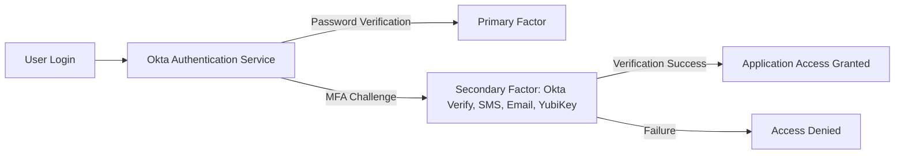

#  Multi-Factor Authentication (MFA) in Okta

##  Project Overview

This project demonstrates how to implement **Multi-Factor Authentication (MFA)** in Okta to protect user accounts and enforce contextual, adaptive access. The goal is to reduce the risk of credential-based attacks by requiring multiple authentication factors based on policies such as **location, device, and network**.

---

##  Architecture



---

##  Key Features

* **MFA Enrollment Policy**: Required users to enroll at first login.
* **Supported Factors**: Okta Verify Push, TOTP, SMS, Email, Security Keys (FIDO2/WebAuthn).
* **Adaptive MFA**: Context-based enforcement (e.g., external vs. internal login).
* **Step-Up Authentication**: Sensitive apps require an extra MFA prompt even for logged-in users.
* **Self-Service Management**: Users can reset/re-enroll factors from Okta dashboard.

---

##  Implementation

### 1. **Enable MFA in Okta**

* Navigate to **Okta Admin Console → Security → Multifactor**.
* Enable factors:

  * Okta Verify (Push & TOTP).
  * SMS Authentication.
  * FIDO2/WebAuthn.

---

### 2. **Policy Configuration**

* Created a **Default MFA Policy**:

  * Require MFA for all users.
  * Allowed factors: Okta Verify, SMS.
* Created a **High-Security Policy**:

  * Applied only to Finance & Admin groups.
  * Required FIDO2 security keys for step-up access.

---

### 3. **Adaptive MFA Rules**

* **Internal Network**: Only password required.
* **External Access**: Password + MFA (Okta Verify Push).
* **High-Risk Device or Location**: Block access or enforce FIDO2 key.

Example Policy Logic:

```text
IF user.location != "Corporate Network" 
AND app == "FinanceApp"
THEN require Okta Verify + FIDO2
```

---

### 4. **Step-Up Authentication Example**

* When accessing sensitive apps (e.g., Workday Payroll, Admin Console), Okta requires an extra MFA check **even if the user already logged in**.

---

### 5. **Sample Okta API MFA Verification**

```python
import requests

OKTA_DOMAIN = "https://your-okta-org.okta.com"
API_TOKEN = "your_api_token"

headers = {
    "Authorization": f"SSWS {API_TOKEN}",
    "Content-Type": "application/json"
}

def verify_mfa(user_id, factor_id, passcode):
    url = f"{OKTA_DOMAIN}/api/v1/users/{user_id}/factors/{factor_id}/verify"
    payload = { "passCode": passcode }
    response = requests.post(url, headers=headers, json=payload)
    return response.json()

# Example Usage
verify_response = verify_mfa("00u1abcdEFG1234XYZ", "ost1abcd12345EFGXYZ", "123456")
print(verify_response)
```

---

##  Outcomes

* **Strengthened security** with multiple factors of authentication.
* **Reduced phishing risk** by enabling push-based Okta Verify.
* **Context-aware security**: Only enforced MFA when risk factors present.
* **Compliance-ready**: Meets industry standards (NIST, PCI DSS).

---

